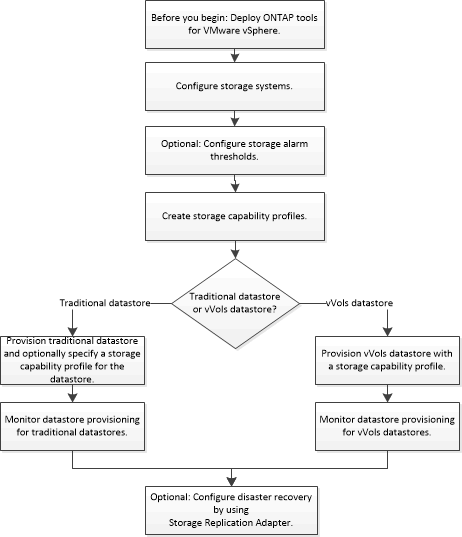

= Workflow per la configurazione degli strumenti ONTAP
:allow-uri-read: 
:icons: font
:imagesdir: ../media/

[role="lead"]
La configurazione degli strumenti ONTAP comporta la configurazione dei sistemi storage, la creazione di un profilo di capacità storage, il provisioning dell'archivio dati e, facoltativamente, la configurazione di SRA per il disaster recovery.

